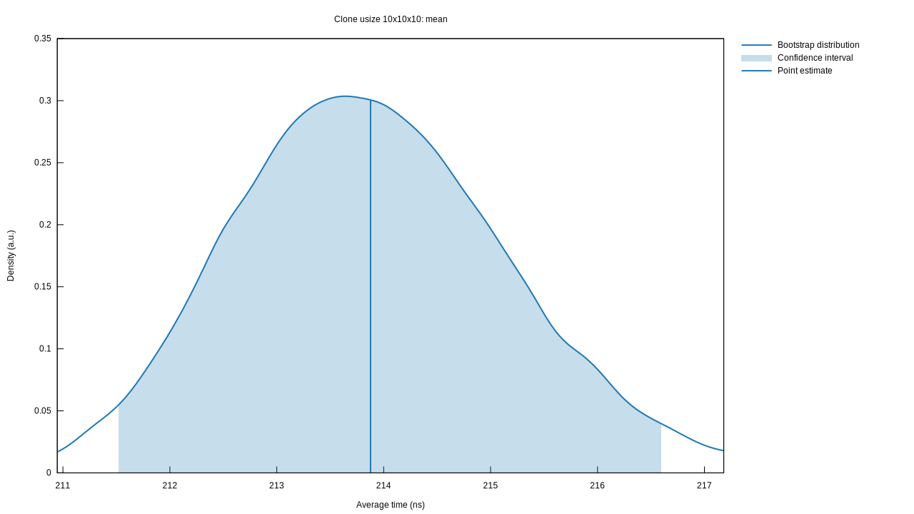
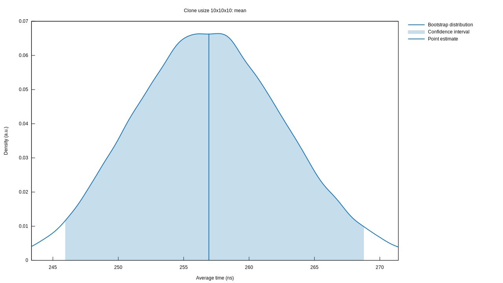

# Benchmarking
## What are we benchmarking?
After writing [implementation/initialization.md], i got curious about the performance difference
between two implementations of `#!rust Clone`. The naive approach looks like this:
```rust linenums="37"
impl<T: Clone, const N: usize> Clone for Array<T, N> {
    fn clone(&self) -> Self {
        let mut cloned: Self;
        // Safe because we won't be reading from uninitialized memory.
        unsafe {
            cloned = Array::uninitialized(self.dim);
        }

        // clone each element (can probably be done faster)
        for offset in 0..self.size() {
            // safe because offset will never exceed self.size()
            unsafe {
                *cloned._get_mut_unchecked(offset) = self._get_unchecked(offset).clone();
            }
        }
        cloned
    }
}
```

This is obviously pretty inefficient since we are cloning each element from the original 
and writing it to the destination. It (probably) would be faster to copy all of the
original array's heap data and write it in one go. I came up with this implementation:

```rust linenums="37"
impl<T: Copy, const N: usize> Clone for Array<T, N> {
    fn clone(&self) -> Self {
        let mut cloned: Self;
        // Safe because we won't be reading from uninitialized memory.
        unsafe {
            cloned = Array::uninitialized(self.dim);
        }

        // Safe because
        // * T is Copy
        // * self.ptr is valid for self.size() reads
        // * cloned.ptr is valid for self.size() writes
        // * both self and cloned are properly aligned
        // * self and cloned do not overlap
        unsafe {
            std::ptr::copy_nonoverlapping(self.ptr, cloned.ptr, self.size());
        }

        cloned
    }
}
```
## Running the benchmark
First, you need to install cargo-criterion using `cargo install cargo-criterion`.
You can then run all benchmarks with `cargo criterion`.

### First method
These are the mean times for cloning a `10x10x10` array using the naive approach:
{ loading=lazy }
Criterion actually provides a lot more plots than just this one, but too keep this example simple i decided to focus only on the mean time.

### Second method
These are the benchmark results for the second approach:
{ loading=lazy }
Interestingly enough, this is ~40ns slower than copying each element seperately. I do not know exactly why this is the case,
but i suspect the compiler might be able to optimize away the bloat from the first approach.

